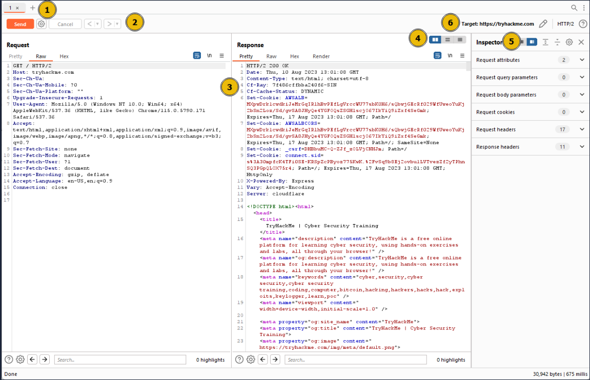
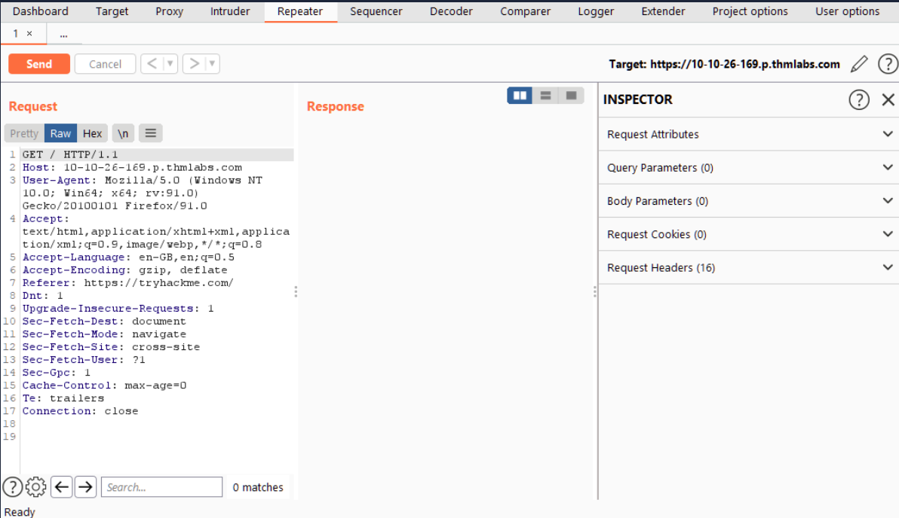
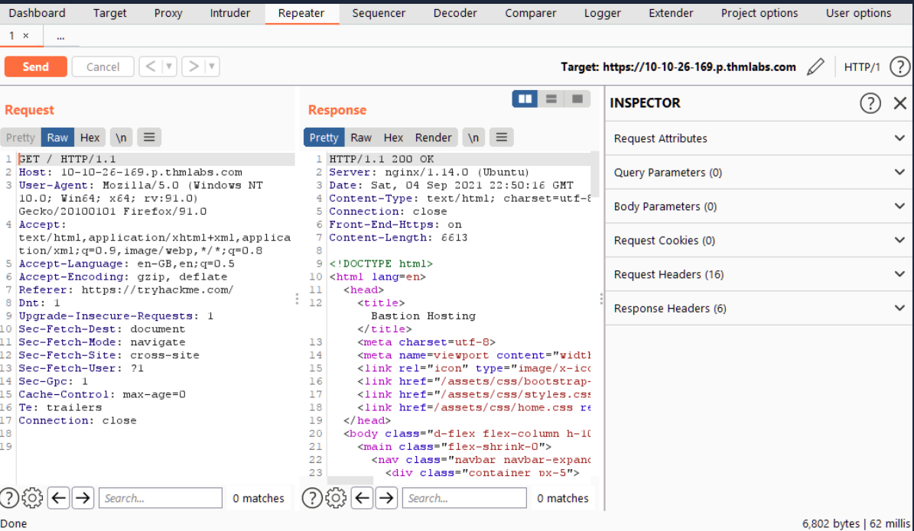
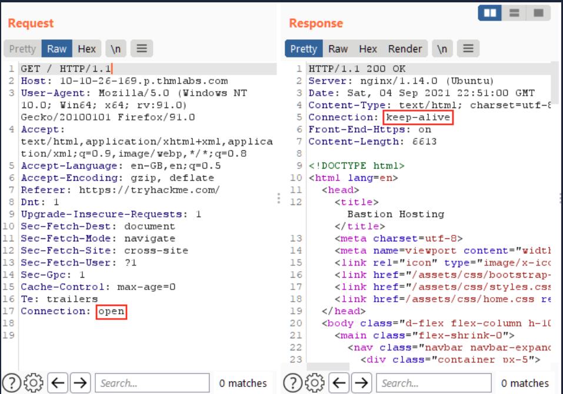
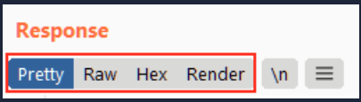
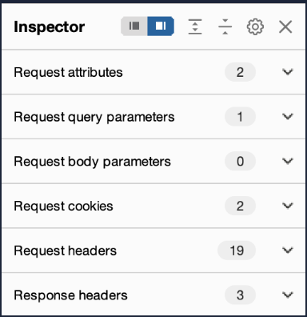

# Burp Suite: Repeater

# What Is Repeater:

- In essence, Burp Suite Repeater enables us to modify and resend intercepted requests to a target of our choosing.
- It allows us to take requests captured in the Burp Proxy and manipulate them, sending them repeatedly as needed.
- Alternatively, we can manually create requests from scratch, similar to using a command-line tool like cURL
- The ability to edit and resend requests multiple times makes Repeater invaluable for manual exploration and testing of endpoints
- It provides a user-friendly graphical interface for crafting request payloads and offers various views of the response, including a rendering engine for a graphical representation

### 1-Request List:

- Located at the top left of the tab, it displays the list of Repeater requests.
- Multiple requests can be managed simultaneously, and each new request sent to Repeater will appear here.

### 2-Request Controls:

- Positioned directly beneath the request list, these controls allow us to send a request, cancel a hanging request, and navigate through the request history.

### **3-Request and Response View:**

- Occupying the majority of the interface, this section displays the **Request** and **Response** views.
- We can edit the request in the Request view and then forward it, while the corresponding response will be shown in the Response view.

### **4-Layout Options**:

- Located at the top-right of the Request/Response view, these options enable us to customize the layout of the Request and Response views.
- The default setting is a side-by-side (horizontal) layout, but we can also choose a vertical layout or combine them in separate tabs.

### 5-**Inspector**:

- Positioned on the right-hand side, the Inspector allows us to analyze and modify requests in a more intuitive manner than using the raw editor.
- We will explore this feature in a later task.

### 6-Target:

- Situated above the Inspector, the Target field specifies the IP address or domain to which the requests are sent.
- When requests are sent to Repeater from other Burp Suite components, this field is automatically populated.

# Basic Usage:

- is more common to capture a request using the Proxy module and subsequently transmit it to Repeater for further editing and resending.
- Once a request has been captured in the Proxy module, we can send it to Repeater by either right-clicking on the request and selecting **Send to Repeater**, or by utilizing the keyboard shortcut `Ctrl + R`.
- Shifting our focus back to Repeater, we can observe that our captured request is now accessible in the Request view:

- Should we wish to modify any aspect of the request, we can simply type within the Request view and press **Send** once again.
- This action will update the Response view on the right accordingly.
- For instance, altering the **Connection** header to "open" instead of "close" yields a response with a **Connection** header containing the value "keep-alive":
    
    
    

# Message Analysis toolbar

- Repeater provides us with various request and response presentation options, ranging from hexadecimal output to a fully rendered page.

### Pretty:

- This is the default option, which takes the raw response and applies slight formatting enhancements to improve readability.

### Raw:

- This option displays the unmodified response directly received from the server without any additional formatting.

### Hex:

- By selecting this view, we can examine the response in a byte-level representation, which is particularly useful when dealing with binary files.

### Render:

- The render option allows us to visualize the page as it would appear in a web browser.
- While not commonly utilised in Repeater, as our focus is usually on the source code, it still offers a valuable feature.
- For most scenarios, the **Pretty** option is generally sufficient.
- However, it is beneficial to be acquainted with the usage of the other three options.

- Adjacent to the view buttons, on the right-hand side, we find the **Show non-printable** characters button (`\n`).
- This functionality enables the display of characters that may not be visible with the **Pretty** or **Raw** options.
- For example, each line in the response typically ends with the characters `\r\n`, representing a carriage return followed by a new line.
- These characters play an important role in the interpretation of HTTP headers.
- While not mandatory for most tasks, this option can prove advantageous in certain situations.

# Inspector:

- Inspector is a supplementary feature to the Request and Response views in the Repeater module.
- It is also used to obtain a visually organized breakdown of requests and responses, as well as for experimenting to see how changes made using the higher-level Inspector affect the equivalent raw versions.
- Inspector can be utilized both in the Proxy and Repeater module.
- In both instances, it is situated on the far-right side of the window, presenting a list of components within the request and response:
    
    
    

- Among these components, the sections pertaining to the request can typically be modified, enabling the addition, editing, and removal of items.
- For instance, in the **Request Attributes** section, we can alter elements related to the location, method, and protocol of the request.
- This includes modifying the desired resource to retrieve, changing the HTTP method from GET to another variant, or switching the protocol from HTTP/1 to HTTP/2:

### 1- **Request Query Parameters:**

- These refer to data sent to the server via the URL.
- For example, in a GET request like `https://admin.tryhackme.com/?redirect=false`, the query parameter **redirect** has a value of "false".

### 2- **Request Body Parameters:**

- Similar to query parameters, but specific to POST requests.
- Any data sent as part of a POST request will be displayed in this section, allowing us to modify the parameters before resending.

### 3-**Request Cookies:**

- This section contains a modifiable list of cookies sent with each request

### 4-**Request Headers:**

- It enables us to view, access, and modify (including adding or removing) any headers sent with our requests.
- Editing these headers can be valuable when examining how a web server responds to unexpected headers.

### 5- Response Headers:

- This section displays the headers returned by the server in response to our request.
- It cannot be modified, as we have no control over the headers returned by the server.
- Note that this section becomes visible only after sending a request and receiving a response.

- Repeater is particularly well-suited for tasks requiring repetitive sending of similar requests, typically with minor modifications.
- This is particularly useful for activities such as manual testing for SQL Injection vulnerabilities (to be covered in a forthcoming task), attempting to bypass web application firewall filters, or adjusting parameters in a form submission.