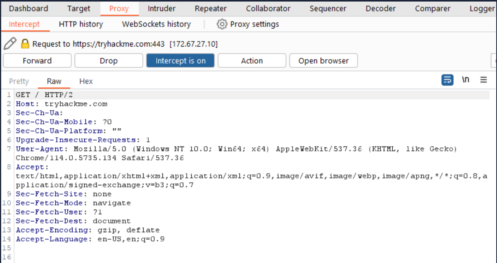

# Burp Suite: The Basics

# Burp suite

## What it is:

- **Burp Suite** is a **web application security testing tool**.
- It helps you **find vulnerabilities** in websites and web apps.
- It’s mostly used by **security researchers** and **ethical hackers**.
- It acts like a **proxy between your browser and the web server**, so you can intercept and analyze traffic.

## Main Features of Burp Suite

### 1.Proxy

- Intercepts HTTP/HTTPS requests and responses.
- Lets you **modify requests** before sending them to the server.

### 2.Scanner (Professional version)

- Automatically scans web apps for vulnerabilities (SQLi, XSS, etc.).

### 3.Repeater

- Lets you **send requests manually** multiple times.
- Good for testing input changes and seeing server responses.

### 4.Intruder

- Automates **brute-force attacks** or fuzzing.
- Can test login forms, parameters, or cookies.

### 5.Decoder

- Encode or decode data (Base64, URL, hex).

### 6.Comparer

- Compare two responses to find differences.

### 7.Extensions (BApp Store)

- Add custom functionality using **Java, Python, or JavaScript extensions**.

## How Burp Suite Works

- 1- Set up your browser to use Burp as a proxy.
- 2- **Open Burp Suite** and go to the Proxy tab.
- 3- **Intercept requests** from your browser.
- 4- **Modify or replay requests** using Repeater or Intruder.
- 5- **Analyze responses** to find vulnerabilities.

## Common Uses

- Test **SQL Injection (SQLi)**
- Test **Cross-Site Scripting (XSS)**
- Test **Insecure Direct Object References (IDOR)**
- Find **broken authentication** or session issues
- Test **web API security**

# What Is Burp Suite:

- In essence, Burp Suite is a Java-based framework designed to serve as a comprehensive solution for conducting web application penetration testing.
- It has become the industry standard tool for hands-on security assessments of web and mobile applications, including those that rely on **a**pplication **p**rogramming **i**nterface**s** (APIs).
- Simply put, Burp Suite captures and enables manipulation of all the HTTP/HTTPS traffic between a browser and a web server.
- By intercepting requests, users have the flexibility to route them to various components within the Burp Suite framework,
- The ability to intercept, view, and modify web requests before they reach the target server or even manipulate responses before they are received by our browser makes Burp Suite an invaluable tool for manual web application testing.
- Burp Suite is available in different editions. For our purposes, we will focus on the **Burp Suite Community Edition**, which is freely accessible for non-commercial use within legal boundaries.
- However, it's worth noting that Burp Suite also offers Professional and Enterprise editions, which come with advanced features and require licensing:

## Burp Suite Professional:

- is an unrestricted version of Burp Suite Community
- An automated vulnerability scanner.
- A fuzzer/brute-forcer that isn't rate limited.
- Saving projects for future use and report generation.
- A built-in API to allow integration with other tools.
- Unrestricted access to add new extensions for greater functionality.
- Access to the Burp Suite Collaborator (effectively providing a unique request catcher self-hosted or running on a Portswigger-owned server).
- In short, Burp Suite Professional is a highly potent tool, making it a preferred choice for professionals in the field.

## Burp Suite Enterprise:

- in contrast to the community and professional editions, is primarily utilized for continuous scanning
- It features an automated scanner that periodically scans web applications for vulnerabilities, similar to how tools like Nessus perform automated infrastructure scanning.
- Unlike the other editions, which allow manual attacks from a local machine, Burp Suite Enterprise resides on a server and constantly scans the target web applications for potential vulnerabilities.

## Burp Suite Community:

- Although Burp Suite Community offers a more limited feature set compared to the Professional edition, it still provides an impressive array of tools that are highly valuable for web application testing.

### proxy:

- The Burp Proxy is the most renowned aspect of Burp Suite.
- It enables interception and modification of requests and responses while interacting with web applications.

### Repeater:

- Repeater allows for capturing, modifying, and resending the same request multiple times.
- This functionality is particularly useful when crafting payloads through trial and error (e.g., in SQLi - Structured Query Language Injection) or testing the functionality of an endpoint for vulnerabilities.

### Intruder:

- Despite rate limitations in Burp Suite Community, Intruder allows for spraying endpoints with requests.
- It is commonly utilized for brute-force attacks or fuzzing endpoints.

### Decoder:

- Decoder offers a valuable service for data transformation.
- It can decode captured information or encode payloads before sending them to the target.
- While alternative services exist for this purpose, leveraging Decoder within Burp Suite can be highly efficient.

### Comparer:

- As the name suggests, Comparer enables the comparison of two pieces of data at either the word or byte level.
- While not exclusive to Burp Suite, the ability to send potentially large data segments directly to a comparison tool with a single keyboard shortcut significantly accelerates the process.

### Sequencer:

- Sequencer is typically employed when assessing the randomness of tokens, such as session cookie values or other supposedly randomly generated data.
- If the algorithm used for generating these values lacks secure randomness, it can expose avenues for devastating attacks.

- Beyond the built-in features, the Java codebase of Burp Suite facilitates the development of extensions to enhance the framework's functionality
- These extensions can be written in Java, Python (using the Java Jython interpreter), or Ruby (using the Java JRuby interpreter).
- The **Burp Suite Extender** module allows for quick and easy loading of extensions into the framework, while the marketplace, known as the **BApp Store**, enables downloading of third-party modules.

# Dashboard

## Tasks:

- The Tasks menu allows you to define background tasks that Burp Suite will perform while you use the application.
- In Burp Suite Community, the default “Live Passive Crawl” task, which automatically logs the pages visited, is sufficient for our purposes in this module.
- Burp Suite Professional offers additional features like on-demand scans.

## Event Log:

- The Event log provides information about the actions performed by Burp Suite, such as starting the proxy, as well as details about connections made through Burp.

## Issue Acticity:

- This section is specific to Burp Suite Professional.
- It displays the vulnerabilities identified by the automated scanner, ranked by severity and filterable based on the certainty of the vulnerability.

## Advisory:

- The Advisory section provides more detailed information about the identified vulnerabilities, including references and suggested remediations.
- This information can be exported into a report.
- In Burp Suite Community, this section may not show any vulnerabilities.

# Options

- let's explore the available options for configuring Burp Suite
- There are two types of settings: Global settings (also known as User settings) and Project settings.
- ***Global Settings:*** These settings affect the entire Burp Suite installation and are applied every time you start the application. They provide a baseline configuration for your Burp Suite environment.
- ***Project Settings:*** These settings are specific to the current project and apply only during the session. However, please note that Burp Suite Community Edition does not support saving projects, so any project-specific options will be lost when you close Burp.

# Introduction to the Burp Proxy:

- The Burp Proxy is a fundamental and crucial tool within Burp Suite
- It enables the capture of requests and responses between the user and the target web server.
- This intercepted traffic can be manipulated, sent to other tools for further processing, or explicitly allowed to continue to its destination.

## **Key Points to Understand About the Burp Proxy**

### **Intercepting Requests:**

- When requests are made through the Burp Proxy, they are intercepted and held back from reaching the target server.
- The requests appear in the Proxy tab, allowing for further actions such as forwarding, dropping, editing, or sending them to other Burp modules.
- To disable the intercept and allow requests to pass through the proxy without interruption, click the `Intercept is on` button.
    
    
    

### Taking Control:

- The ability to intercept requests empowers testers to gain complete control over web traffic, making it invaluable for testing web applications.

### **Capture and Logging:**

- Burp Suite captures and logs requests made through the proxy by default, even when the interception is turned off.
- This logging functionality can be helpful for later analysis and review of prior requests.

### **WebSocket Support:**

- Burp Suite also captures and logs WebSocket communication, providing additional assistance when analysing web applications.

### **Logs and History:**

- The captured requests can be viewed in the **HTTP history** and **WebSockets history** sub-tabs, allowing for retrospective analysis and sending the requests to other Burp modules as needed.
    
    
    

- Proxy-specific options can be accessed by clicking the **Proxy settings** button.
- These options provide extensive control over the Proxy’s behaviour and functionality.

## **Some Notable Features in the Proxy Settings**

### **Response Interception:**

- By default, the proxy does not intercept server responses unless explicitly requested on a per-request basis.
- The "Intercept responses based on the following rules" checkbox, along with the defined rules, allows for a more flexible response interception.
    
    
    

### **Match and Replace:**

- The "Match and Replace" section in the **Proxy settings** enables the use of regular expressions (regex) to modify incoming and outgoing requests.
- This feature allows for dynamic changes, such as modifying the user agent or manipulating cookies.

# Site Map and Issue Definitions

- The **Target** tab in Burp Suite provides more than just control over the scope of our testing. It consists of three sub-tabs:

### 1-**Site map**:

- This sub-tab allows us to map out the web applications we are targeting in a tree structure.
- Every page that we visit while the proxy is active will be displayed on the site map.
- This feature enables us to automatically generate a site map by simply browsing the web application.
- In Burp Suite Professional, we can also use the site map to perform automated crawling of the target, exploring links between pages and mapping out as much of the site as possible.
- Even with Burp Suite Community, we can still utilize the site map to accumulate data during our initial enumeration steps.
- It is particularly useful for mapping out APIs, as any API endpoints accessed by the web application will be captured in the site map.

### 2-Issue Definition:

- Although Burp Community does not include the full vulnerability scanning functionality available in Burp Suite Professional, we still have access to a list of all the vulnerabilities that the scanner looks for.
- The **Issue definitions** section provides an extensive list of web vulnerabilities, complete with descriptions and references.
- This resource can be valuable for referencing vulnerabilities in reports or assisting in describing a particular vulnerability that may have been identified during manual testing.

### 3-**Scope settings**:

- This setting allows us to control the target scope in Burp Suite.
- It enables us to include or exclude specific domains/IPs to define the scope of our testing.
- By managing the scope, we can focus on the web applications we are specifically targeting and avoid capturing unnecessary traffic.

- Overall, the **Target** tab offers features beyond scoping, allowing us to map out web applications, fine-tune our target scope, and access a comprehensive list of web vulnerabilities for reference purposes.

# Scoping and Targeting

- we come to one of the most important aspects of using the Burp Proxy: **Scoping**.
- Capturing and logging all of the traffic can quickly become overwhelming and inconvenient, especially when we only want to focus on specific web applications
- This is where scoping comes in.
- By setting a scope for the project, we can define what gets proxied and logged in Burp Suite
- We can restrict Burp Suite to target only the specific web application(s) we want to test.
- The easiest way to do this is by switching to the `Target` tab, right-clicking on our target from the list on the left, and selecting `Add To Scope`