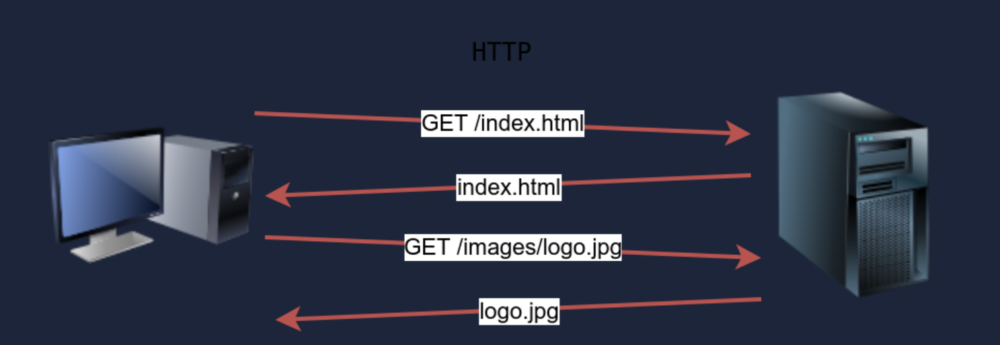

# Protocols and Servers 2

# Sniffing Attack

## What is a Sniffing Attack?

- A **sniffing attack** is a technique where an attacker **captures and analyzes network traffic** to **steal sensitive data**.

In simple words:

- **The attacker listens to data moving through the network.**

## What kind of data can be sniffed?

If traffic is **unencrypted**, an attacker can capture:

- Usernames
- Passwords
- Session cookies
- Emails
- Files
- HTTP requests & responses

Protocols most vulnerable:

- **HTTP**
- **FTP**
- **Telnet**
- **POP3**
- **SMTP**

### How Sniffing Works (Basic Idea)

1. Data travels as **packets** over the network
2. Attacker puts their network card in **promiscuous mode**
3. Network card captures **all packets**, not just its own
4. Attacker analyzes packets using sniffing tools

## Types of Sniffing

### Passive Sniffing

- Attacker **only listens**
- No modification of traffic
- Works mainly on:
    - Hubs
    - Wireless networks

✅ Very hard to detect

### Active Sniffing

- Attacker **interacts with the network**
- Used on **switched networks**
- Often combined with:
    - ARP Spoofing
    - MITM attacks

❌ Easier to detect

### Sniffing vs MITM

| Sniffing | MITM |
| --- | --- |
| Just listens | Intercepts & modifies |
| Passive | Active |
| No packet change | Packet manipulation |

📌 Sniffing is often a **part of MITM attacks**.

### Common Sniffing Tools

| Tool | Purpose |
| --- | --- |
| **Wireshark** | Packet analysis |
| **tcpdump** | CLI sniffing |
| **Ettercap** | MITM + sniffing |
| **dsniff** | Credential sniffing |
| **Bettercap** | Advanced MITM |

### Example of a Sniffing Attack (HTTP)

1. Victim logs in to a website using **HTTP**
2. Credentials sent in **plain text**
3. Attacker captures packets
4. Attacker reads:
5. username=admin&password=123456
6. This is why **HTTP is dangerous**.

## Sniffing Attack on FTP

FTP sends:

- USER admin
PASS password
- Attacker can read credentials **directly**.

## How to Prevent Sniffing Attacks

| Method | Explanation |
| --- | --- |
| **HTTPS** | Encrypts HTTP traffic |
| **SSH / SFTP** | Secure alternatives |
| **VPN** | Encrypts all traffic |
| **Switches** | Reduce passive sniffing |
| **ARP protection** | Prevent spoofing |
- Encryption = best defense

# Man-in-the-Middle (MITM) Attack

## What is a MITM Attack?

A **Man-in-the-Middle (MITM) attack** is an attack where the attacker **positions themselves between two communicating parties** and can:

- **Eavesdrop (sniff)** the communication
- **Modify** the data
- **Inject** malicious content

In simple words:

**The attacker secretly sits between the client and the server.**

## How MITM Works

1. Client thinks it’s talking to the server
2. Server thinks it’s talking to the client
3. Attacker sees **everything in between**

This is more powerful than simple sniffing.

## MITM vs Sniffing

| Sniffing | MITM |
| --- | --- |
| Only listens | Listens + modifies |
| Passive | Active |
| Harder to notice | More detectable |

## Common MITM Techniques

### ARP Spoofing (Most Common)

- Attacker poisons ARP tables
- Traffic is redirected through attacker

📌 Used in local networks (LAN)

### DNS Spoofing

- Attacker gives fake DNS responses
- Victim goes to a fake website

### IP Spoofing

- Attacker fakes source IP
- Often combined with MITM methods

### SSL Stripping

- Downgrades HTTPS → HTTP
- Makes encrypted traffic readable

### Rogue Wi-Fi (Evil Twin)

- Fake Wi-Fi access point
- Victims connect unknowingly

## Data Stolen in MITM Attacks

- Login credentials
- Session cookies
- Personal data
- Financial information
- API keys

## Example MITM Attack (ARP Spoofing)

1. Victim sends traffic to gateway
2. Attacker sends fake ARP replies
3. Victim sends traffic to attacker
4. Attacker forwards traffic to real gateway
5. Victim doesn’t notice

Attacker can now sniff or modify packets.

## MITM Attack Tools

| Tool | Purpose |
| --- | --- |
| **Ettercap** | ARP spoofing + MITM |
| **Bettercap** | Modern MITM framework |
| **dsniff** | Credential sniffing |
| **Wireshark** | Traffic analysis |
| **Cain & Abel** | Windows MITM |

## MITM and Encryption

| Encrypted? | MITM Possible? |
| --- | --- |
| HTTP | ✅ Yes |
| FTP | ✅ Yes |
| Telnet | ✅ Yes |
| HTTPS (TLS) | ❌ Very hard |
| SSH | ❌ Very hard |
- HTTPS doesn’t fully stop MITM, but **makes it extremely difficult**.

## How to Prevent MITM Attacks

| Defense | Explanation |
| --- | --- |
| **HTTPS + TLS** | Encrypt traffic |
| **Certificate validation** | Detect fake certs |
| **VPN** | Encrypts all traffic |
| **ARP inspection** | Prevent ARP spoofing |
| **Avoid public Wi-Fi** | Reduces risk |

# Ettercap

## What is Ettercap?

- **Ettercap** is a **network security tool** used to perform **Man-in-the-Middle (MITM) attacks** on a local network.

It allows an attacker to:

- Sniff network traffic
- Intercept communications
- Modify packets in real time
- Steal credentials

In simple words:

- Ettercap puts you between two devices and lets you see or change their traffic.

## Where does Ettercap work?

- **Network type:** Local Area Network (LAN)
- Works mainly with:
    - **ARP-based networks**
    - Switched Ethernet networks
- Requires being on the **same network** as the victim

## Main Technique Used by Ettercap

- ARP Spoofing / ARP Poisoning
- Ettercap sends fake ARP replies so that:
- Victim thinks attacker = gateway
- Gateway thinks attacker = victim
- Victim → Attacker → Router → Internet
- This creates a **MITM position**.

## Ettercap Features

| Feature | Description |
| --- | --- |
| ARP poisoning | MITM creation |
| Packet sniffing | Capture credentials |
| Packet injection | Modify traffic |
| Filters | Change packets on the fly |
| Plugin system | Extra attack modules |

## Common Protocols Ettercap Can Sniff

- If traffic is **unencrypted**, Ettercap can easily read:
- HTTP
- FTP
- Telnet
- POP3
- SMTP
- Encrypted traffic (HTTPS, SSH) is much harder.

# Bettercap

## What is Bettercap?

**Bettercap** is a **modern network attack framework** used for:

- **Man-in-the-Middle (MITM) attacks**
- Network sniffing
- Credential harvesting
- Packet manipulation
- Wi-Fi and LAN attacks

 In simple words:

**Bettercap is an advanced, newer alternative to Ettercap.**

## Where does Bettercap work?

- **Local Area Networks (LAN)**
- **Wi-Fi networks**
- Requires being on the **same network** as the victim

## Bettercap vs Ettercap

| Feature | Bettercap | Ettercap |
| --- | --- | --- |
| Interface | CLI + Web UI | CLI + GUI |
| Speed | Faster | Slower |
| Modular | Yes | Limited |
| Wi-Fi attacks | Yes | No |
| Actively maintained | Yes | Mostly outdated |
- Bettercap is preferred today.

# TLS (Transport Layer Security)

## What is TLS?

**TLS (Transport Layer Security)** is a **cryptographic protocol** that provides **secure communication** over a network.

It ensures:

- 🔐 **Confidentiality** (encryption)
- ✅ **Integrity** (data not modified)
- 🧾 **Authentication** (server identity)

👉 In simple words:

**TLS encrypts data so attackers can’t read or change it.**

## Where does TLS work?

- Works **between Application Layer and Transport Layer**
- Uses **TCP**
- Common ports:
    - **HTTPS → 443**
    - **FTPS → 990**
    - **SMTPS → 465**
    - **IMAPS → 993**

📌 TLS protects application protocols like:

- HTTP → **HTTPS**
- FTP → **FTPS**
- SMTP → **SMTPS**

## TLS vs SSL

| SSL | TLS |
| --- | --- |
| Old | New |
| Insecure | Secure |
| Deprecated | Actively used |
- SSL is dead
- When people say *SSL*, they usually mean **TLS**

## What Problems Does TLS Solve?

Without TLS:

- MITM attacks
- Sniffing attacks
- Credential theft

With TLS:

- Encrypted traffic
- MITM becomes extremely hard
- Secure authentication

## TLS Handshake

- The **TLS handshake** is how secure communication starts.
- **1-Client Hello**
    - TLS version
    - Cipher suites
- **2-Server Hello**
    - Chosen cipher
    - Digital certificate
- **3-Certificate Verification**
    - Client verifies server identity
- **4-Key Exchange**
    - Shared secret created
- **5-Secure Session Starts**
    - All data is encrypted
- After handshake → **symmetric encryption** (fast)

## Digital Certificates

TLS uses **X.509 certificates** which contain:

- Domain name
- Public key
- Issued by **Certificate Authority (CA)**

Examples of CAs:

- Let’s Encrypt
- DigiCert
- GlobalSign

📌 Browser trusts the CA → trusts the website

## Encryption in TLS

TLS uses **two types of cryptography**:

| Type | Purpose |
| --- | --- |
| Asymmetric | Key exchange |
| Symmetric | Data encryption |

📌 Best of both worlds: **secure + fast**

# scp command

- **SCP** is a **command-line tool** used to **securely copy files and directories** between computers over a network.
- SCP securely copies files using SSH encryption.

# Password Attack

## What is a Password Attack?

- A **password attack** is an attempt to **gain unauthorized access** to a system by **guessing, stealing, or cracking passwords**.

👉 In simple words:

- **The attacker tries to get the correct password to log in.**

## Why Password Attacks Work

Password attacks succeed mainly because:

- Weak passwords
- Reused passwords
- No rate limiting
- No multi-factor authentication (MFA)
- Poor password storage (bad hashing)

## Common Types of Password Attacks

### Brute Force Attack

- Tries **every possible password combination**
- Very slow but guaranteed if no protection

📌 Example idea:

`aaaa → aaab → aaac → ...`

### Dictionary Attack

- Uses a **wordlist** of common passwords
- Faster than brute force

📌 Examples:

password
123456
admin123
qwerty

### Credential Stuffing

- Uses **leaked username–password pairs**
- Relies on **password reuse**

📌 Very common in real-world breaches.

### Password Spraying

- Tries **one common password** on many users
- Avoids account lockouts

📌 Example:

`Winter2024!` → many accounts

### Rainbow Table Attack

- Uses **precomputed hashes**
- Works if passwords are **unsalted**

📌 Salted hashes defeat this

### Keylogging

- Records keystrokes
- Can steal passwords directly

📌 Often malware-based.

### Phishing

- Tricks users into **giving passwords**
- Most effective attack method

📌 Human weakness > technical weakness

## Online vs Offline Password Attacks

| Type | Online | Offline |
| --- | --- | --- |
| Where | Login page | Stolen hashes |
| Speed | Slow | Very fast |
| Detection | Easy | Hard |
| Example | SSH login | Cracking `/etc/shadow` |