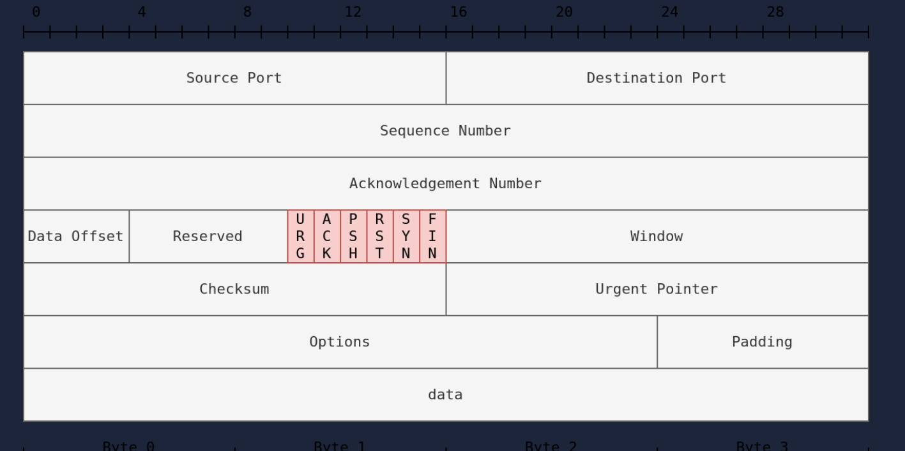

# Nmap Basic Port Scans

# What Is Open Port:

- Open port indicates that there is some service listening on that port.

# What Is Closed Port:

- Closed port indicates that there is no service listening on that port.

# TCP and UDP Ports:

## What Is a Port:

- A **port** is a **numbered communication endpoint** on a computer.

***Think of it like this:***

- **IP address** → building 🏢
- **Port number** → apartment door 🚪
- Ports allow **multiple services** to run on the same IP.

## Why Ports Exist:

Without ports:

- A server wouldn’t know **which application** should receive the data

With ports:

- Web traffic → port 80 / 443
- Email → port 25
- SSH → port 22

## TCP vs UDP (Big Picture)

| Feature | TCP | UDP |
| --- | --- | --- |
| Connection | Connection-oriented | Connectionless |
| Reliability | Reliable | Unreliable |
| Order | Maintains order | No order |
| Speed | Slower | Faster |
| Handshake | Yes (3-way) | No |
| Use cases | Web, SSH, FTP | DNS, VoIP, streaming |

## Port States

### Open:

- indicates that a service is listening on the specified port.

### Closed:

- indicates that no service is listening on the specified port, although the port is accessible.
- By accessible, we mean that it is reachable and is not blocked by a firewall or other security appliances/programs.

### Filtered:

- means that Nmap cannot determine if the port is open or closed because the port is not accessible.
- This state is usually due to a firewall preventing Nmap from reaching that port.
- Nmap’s packets may be blocked from reaching the port; alternatively, the responses are blocked from reaching Nmap’s host

### Unfiltered:

- means that Nmap cannot determine if the port is open or closed, although the port is accessible.
- This state is encountered when using an ACK scan `-sA`.

### Open|Filtered:

- This means that Nmap cannot determine whether the port is open or filtered.

### Closed|Filtered:

- This means that Nmap cannot decide whether a port is closed or filtered.

# TCP Flags:

## What Are TCP Flags:

- **TCP flags** are **control bits** in the TCP header.

***They tell the receiver:***

- What kind of packet this is
- What stage the connection is in
- How to handle the packet
- They are **not data**, they are **instructions**.

## Most Important TCP Flags:

### SYN (Synchronize)

**Purpose:** Start a connection

- Sent by client first
- Used in the 3-way handshake
- Nmap uses SYN heavily (`-sS`).

### ACK (Acknowledgment)

**Purpose:** Confirm receipt

- Acknowledges received packets
- Present in almost all packets after connection

### FIN (Finish)

**Purpose:** Graceful connection close

- Says: “I’m done sending data”

### RST (Reset)

**Purpose:** Forcefully close connection

- Used when port is closed
- Used when something is wrong
- Very important for port scanning.

### PSH (Push)

**Purpose:** Send data immediately

- Tells receiver not to buffer data

### URG (Urgent)

**Purpose:** Urgent data

- Rarely used today

## TCP Flags Summary Table

| Flag | Meaning | Used For |
| --- | --- | --- |
| SYN | Start connection | Handshake, scans |
| ACK | Acknowledge | Normal traffic |
| FIN | Graceful close | Session end |
| RST | Force close | Closed ports |
| PSH | Push data | Applications |
| URG | Urgent data | Rare |

# TCP Connect Scan (-sT)

- Default scan mode when you don’t have sudo privilages

## What Is a TCP Connect Scan

***A TCP Connect Scan is a port scan where Nmap:***

- **Fully completes the TCP 3-way handshake** to check if a port is open.
- It uses the **operating system’s `connect()` system call**.
- This is the **default scan type when Nmap is run without sudo**.

## Why Does Nmap Use TCP Connect Scan?

Because:

- Non-root users **cannot send raw TCP packets**
- The OS handles the connection
- Nmap must rely on standard TCP connections

## TCP Connect Scan vs SYN Scan

| Feature | TCP Connect (`-sT`) | SYN Scan (`-sS`) |
| --- | --- | --- |
| Needs sudo | ❌ No | ✅ Yes |
| Completes handshake | ✅ Yes | ❌ No |
| Speed | Slower | Faster |
| Stealth | Noisy | Stealthier |
| Logged by server | Yes | Sometimes |

## Advantages:

- No special privileges needed
- Accurate results
- Simple

## Disadvantages:

- Slow
- Noisy
- Easy to detect

# TCP SYN Scan (-sS)

- Default scan mode when you have sudo privilages

## What Is a SYN Scan:

***A SYN Scan is a TCP port scan where Nmap:***

- Sends a SYN packet but never completes the TCP handshake

Because of this, it is often called:

- **Half-open scan**
- **Stealth scan**

📌 Requires **root / sudo** privileges.

## Why SYN Scan Is Used:

SYN scan is preferred because it is:

- Faster than TCP Connect
- More stealthy
- Less likely to be fully logged
- Very accurate

This is why it’s **Nmap’s default scan when run with sudo**.

# UDP Scan (-sU)

- sending a UDP packet to an open port won’t tell us anything.
- if a UDP packet is sent to a closed port, an ICMP port unreachable error (type 3, code 3) is returned.

## What Is a UDP Scan:

A **UDP scan** checks **UDP ports** to see whether:

- A UDP service is listening
- The port is closed
- The port is filtered

Unlike TCP, **UDP has no handshake**, which makes scanning harder.

## Why UDP Scanning Is Difficult:

UDP:

- Is **connectionless**
- Often **does not reply**
- Relies on **ICMP error messages**

📌 **Silence does not mean closed**

## Why UDP Scans Are Slow

- Nmap must **wait for timeouts**
- Many ports don’t respond
- Rate limiting on ICMP

UDP scans are **much slower than TCP scans**

## Common UDP Services

| Port | Service |
| --- | --- |
| 53 | DNS |
| 67/68 | DHCP |
| 69 | TFTP |
| 123 | NTP |
| 161 | SNMP |

## Advantages:

- Finds hidden services
- Often overlooked
- Critical for full recon

## Disadvantages:

- Very slow
- Unreliable
- Hard to interpret

# Fine-Tuning Scope and Performance

- You can specify the ports you want to scan instead of the default 1000 ports
- port list: `-p22,80,443` will scan ports 22, 80 and 443.
- port range: `-p1-1023` will scan all ports between 1 and 1023 inclusive
- while `-p20-25` will scan ports between 20 and 25 inclusive.
- You can request the scan of all ports by using `-p-`, which will scan all 65535 ports
- f you want to scan the most common 100 ports, add `-F`
- Using `--top-ports 10` will check the ten most common ports.
- You can control the scan timing using `-T<0-5>`
- paranoid (0)
- sneaky (1)
- polite (2)
- normal (3)
- aggressive (4)
- insane (5)

- To avoid IDS alerts, you might consider `-T0` or `-T1`.
- For instance, `-T0` scans one port at a time and waits 5 minutes between sending each probe, so you can guess how long scanning one target would take to finish
- If you don’t specify any timing, Nmap uses normal `-T3`.
- Note that `-T5` is the most aggressive in terms of speed; however, this can affect the accuracy of the scan results due to the increased likelihood of packet loss.
- Note that `-T4` is often used during CTFs and when learning to scan on practice targets,
- whereas `-T1` is often used during real engagements where stealth is more important.
- Alternatively, you can choose to control the packet rate using `--min-rate <number>` and `--max-rate <number>`.
- For example, `--max-rate 10` or `--max-rate=10` ensures that your scanner is not sending more than ten packets per second.

# Summary

## TCP Connect Scan:

- nmap -sT 10.82.168.78

## TCP SYN Scan:

- sudo nmap -sS 10.82.168.78

## UDP Scan:

- sudo nmap -sU 10.82.168.78

## -p-

- all ports

## -p1-1023

- scan ports 1 to 1023

## -F

- 100 most common ports

## -r

- scan ports in consecutive order

## -T<0-5>

- -T0 being the slowest and T5 the fastest

## —max-rate 50

- rate <= 50 packets/sec

## —min-rate 15

- rate >= 15 packets/sec

## —min-parallelism 100

- at least 100 probes in parallel